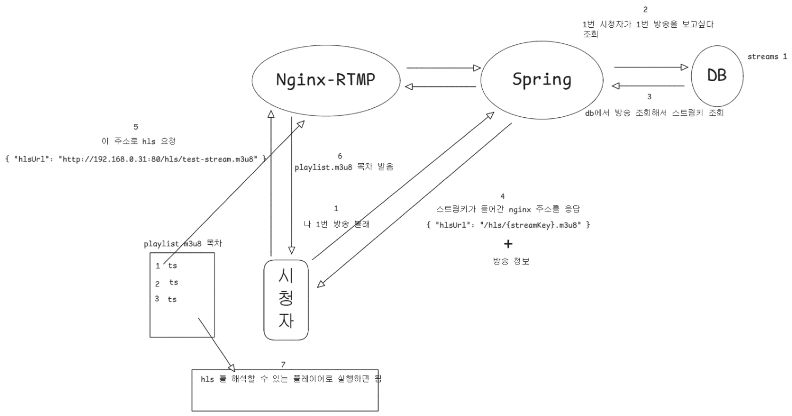
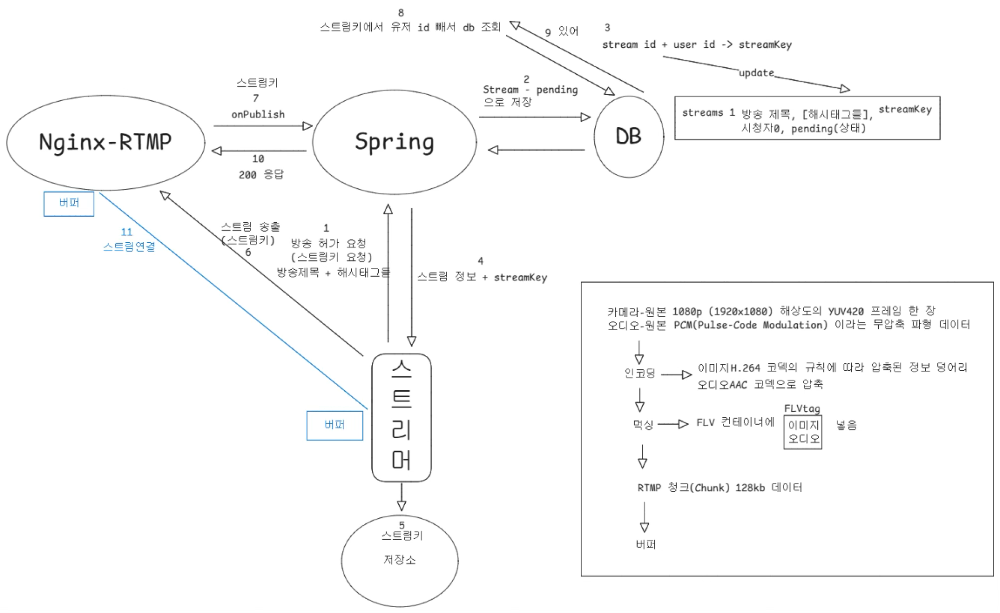

# 🎥 Laviu (라뷰) – 실시간 스트리밍 방송 플랫폼

## 📌 프로젝트 개요

| 구분 | 내용 |
|------|------|
| **언어** | Java, Dart |
| **프레임워크** | Spring (JPA), Flutter |
| **DB** | MySQL, H2 |
| **인프라** | Docker, Nginx |
| **협업/관리** | GitHub, Notion, Slack |
| **개발 기간** | 2025.07 ~ 2025.08 (3주) |
| **개발 인원** | 6명 (프론트 2, 백엔드 4) |

---

## 👩‍💻 담당 역할 (My Contributions)

- **스트리밍 모듈**: RTMP → HLS 변환 구조 설계, Flutter 플레이어 연동, 멀티 해상도 테스트
- **실시간 채팅**: WebSocket 연동, Riverpod 상태 관리, 채팅 UI/UX 구현
- **앱 UI/UX**: 방송 시청/목록 화면 제작, 검색 화면 제작, 데이터 바인딩 최적화

---

## 🔄 송출 / 수신 시스템 흐름

### 송신 (방송자 → 서버)


### 수신 (서버 → 시청자)


---

## ⚡ 스트리밍 모듈 (RTMP → HLS 변환 & Flutter 연동)

### 1) 과제
- Flutter 앱에서 **HLS 스트림을 안정적으로 재생**
- 네트워크 환경에 따라 **자동 화질 전환(ABR)** 및 **수동 화질 선택** 모두 지원

### 2) 핵심 구현

#### 🔹 HLS URL 분기 로직
```dart
String _buildUrl() {
  if (widget.overrideMasterUrl != null) return widget.overrideMasterUrl!; // ABR (자동 화질)
  return MHlsUrl.fixed(
    origin: widget.origin,
    streamKey: widget.streamKey,
    quality: _quality.slug, // '1080p' | '720p' | '480p'
  ); // 수동 화질
}
```
- 마스터 URL (ABR): 네트워크 상태에 따라 자동 화질 선택 → 안정적 시청 경험

- 고정식 URL: 프리셋 기반 화질 전환 (1080p / 720p / 480p) → 멀티 해상도 테스트 가능

🔹 플레이어 초기화 & 에러 처리
```
final c = VideoPlayerController.networkUrl(Uri.parse(url))
  ..setLooping(true);

await c.initialize();
await c.play();
```
- HLS 스트림을 Flutter 네이티브 플레이어와 직접 연결
- 초기화 & 에러 핸들링 로직 구현 → 끊김 없는 재생 UX 확보

### 3) 성과

- RTMP 송출 → HLS 변환 → Flutter 플레이어 재생 파이프라인을 직접 구현
- 자동/수동 화질 전환 지원으로 다양한 환경에서 안정적인 시청 경험 보장
- 단순 라이브러리 사용을 넘어, 스트리밍 아키텍처와 품질 관리까지 고려